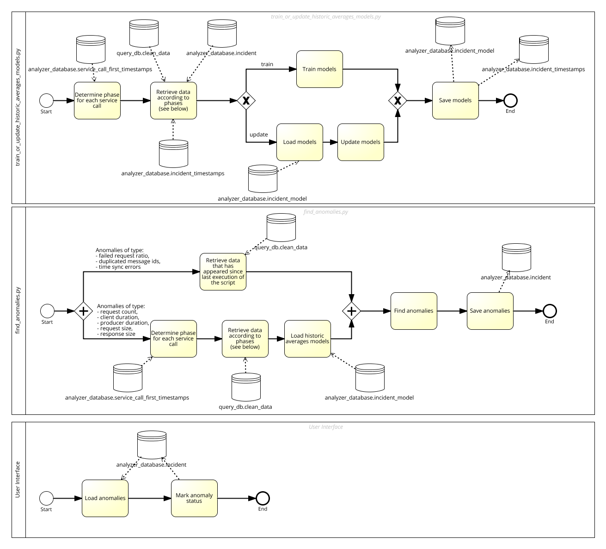

|   |  |
| :-------------------------------------------------- | -------------------------: |

# X-Road v6 monitor project - Analysis Module

## About

The **Analysis module** is part of [X-Road v6 monitor project](../README.md), which includes modules of [Database module](database_module.md), [Collector module](collector_module.md), [Corrector module](corrector_module.md), Analysis module (this document), [Reports module](reports_module.md), [Opendata module](opendata_module.md) and [Networking/Visualizer module](networking_module.md).

The **Analysis module** is responsible for detecting and presenting anomalies in the usage of different X-road components. 

Overall system, its users and rights, processes and directories are designed in a way, that all modules can reside in one server (different users but in same group 'opmon') but also in separate servers. 

Overall system is also designed in a way, that allows to monitor data from different X-Road v6 instances (in Estonia `ee-dev`, `ee-test`, `EE`, see also [X-Road v6 environments](https://moodle.ria.ee/mod/page/view.php?id=700).

Overall system is also designed in a way, that can be used by X-Road Centre for all X-Road members as well as for Member own monitoring (includes possibilities to monitor also members data exchange partners).

## Architecture

The Analysis module consists of two parts:

- **Analyzer:** the back-end of the analysis module, responsible for detecting anomalies based on requests made via the X-road platform.
- **User Interface:** the front-end of the analysis module, responsible for presenting the found anomalies to the user and recording user feedback.

## Networking

### Outgoing
- The Analyzer sub-module needs access to the [Database_Module](../database_module.md).

### Incoming
- The User Interface runs an Apache webserver. Default Apache configuration accepts incoming HTTP requests on port 80. 

## Process

The analyzer program has two stages of operation, *"train and update"* and *"find anomalies"*. 

*TODO: Add a short definition for **service call**.*

As mentioned on the diagram, service calls can be in different *phases*. The phase determines how the analyzer fetches the service call data from the database.

During the train/update stage a service call can be in one of the following phases:

1) pre-training: less than 3 months have passed since the first request was made by that service call. No data are retrieved.
2) first-time training: 3 months have just passed since the first request. All the data will be retrieved for training.
3) second-time training: the first model was trained at least 10 days ago and the first incidents have just expired. Data are retrieved since the beginning until the time of the expired incidents (excluding requests that are part of a "true" incident). The model is retrained.
4) regular: data are retrieved since the last update to the model until the time of the expired incidents (excluding requests that are part of a "true" incident). The model is updated based on these data.

During the anomaly detection stage a service call can be in one of the following phases:

1) pre-training: less than 3 months have passed since the first request was made by that service call. No data are retrieved.
2) first-time anomaly finding: 3 months have passed since the first request and the first version of the model has just been trained. All the data will be retrieved for anomaly finding.
3) regular: data are retrieved since the last anomaly finding time until the "present" moment ("present" means the last valid date considering the corrector buffer, i.e. 10 days ago). Anomalies are found based on these data.

It is important to note that it can take up to 7 days for the [Collector module](collector_module.md) to receive X-Road v6 operational data from security server(s) and up to 3 days for the [Corrector_module](corrector_module.md) to clean the raw data and derive monitoring metrics in a clean database collection.
This means that Analyzer results are available at least 10 days after data received.

## Installation
The Analyzer and Interface are distributed as .deb packages for Ubuntu 20.04. Detailed installation instructions are in these documents: 
* [Analyzer](analysis_module/analyzer_installation.md)
* [User Interface](analysis_module/ui_installation.md)

## Configuration
Descriptions of different secondary configuration / customization files and parameters can be found ==> [here](analysis_module/customization.md) <==

## Usage
Use Case-based functionality descriptions with illustrative screenshots can be found ==> [here](analysis_module/ui_usage.md) <==
