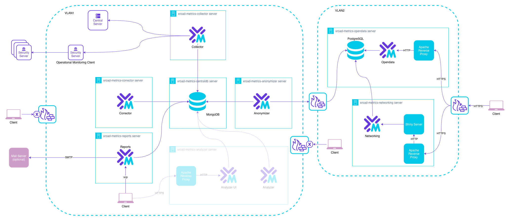
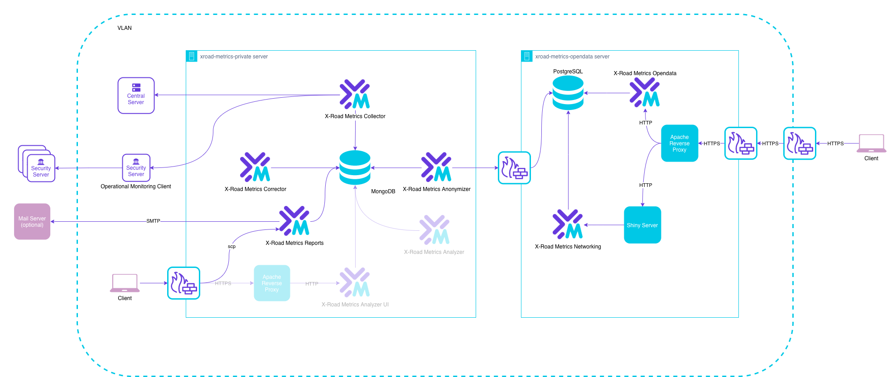

| [](https://x-road.global/) |  |
| :-------------------------------------------------- | -------------------------: |

# X-Road Metrics - System Architecture

X-Road Metrics is a collection of tools that can be used to collect, process and present operational monitoring data
collected from X-Road security servers. The system consists of several modules:

* [Central Database Module (MongoDB)](#database-module)
* [Collector Module](#collector-module)
* [Corrector Module](#corrector-module)
* [Reports Module](#reports-module)
* [Opendata Database Module (PostgreSQL)](#opendata-module)
* [Opendata Module](#opendata-module)
* [Networking/Visualizer Module](#networking-visualizer-module)

In addition to the above modules, the source code includes an [experimental Analyzer Module](#analyzer-module), 
which is not yet released.

This document contains an architecture overview of the interfaces between the modules. 
Also, the document presents some possible hardware infrastructure options that can be used to run X-Road Metrics tools.
The operational specifications and hardware recommendations in this documentation are based on the Estonian production X-Road instance.


## Operational specifications, X-Road instance EE (production)

Expectations and limits below are calculated based on actual usage of X-Road v5 in Estonia. 
They might be reviewed and updated according to future usage of X-Road v6 in Estonia.

Expectations below are valid for overall X-Road usage by all its member organizations.
Usage of X-Road in particular organization or hosted in particular hosting or X-Road security servers farm differs 
significantly, therefore other architecture, hardware and software might used to fulfill particular organization 
requirements.

### Data flow expectation

* It is expected to have maximum 1 billion (1 000 000 000) X-Road v6 service calls (queries) 
  in production environment (Estonia: EE) in 1 year period
* Each query results in two operational monitoring data entries to be collected 
  (from both query partners Client and Producer), id est maximum 2 billion (2 000 000 000) operational monitoring data 
  entries in production environment in 1 year period. This means:
  * 165 000 000 operational monitoring data entries per month
  * 40 000 000 operational monitoring data entries per week
  * 5 500 000 operational monitoring data entries per day
  * 230 000 operational monitoring data entries per hour 
  * 60 000 operational monitoring data entries per 15 minute
* Each of operational monitoring data entry in JSON-format takes approximately 900 B (bytes).
* Each data entry is uploaded into MongoDB as 'raw_messages' and after correction kept there as 'clean_data'. 
  Raw messages are purged periodically.
* Each data entry is published in PostgreSQL as open-data after anonymization.

### Database operational specifications
* MongoDB shall retain 1 year data in disk memory.
* MongoDB shall retain 1 week data in RAM memory for efficient query.
* MongoDB shall run in a replication set for availability.
* PostgreSQL shall retain 1 year of public available data.

### Modules operational specifications

* Collector: runs every 2 hours, collect recent data from security servers and stores them in Database.
* Corrector: runs continuously as a service, use recent data in MongoDB.
* Analyzer: runs every hour, uses MongoDB and local cache in disk.
* Report creator: runs monthly, uses MongoDB, stores reports in disk, publish them on public server and sends out notifications about reports available.
* Open Data Module: runs every day, uses MongoDB recent data, uses PostgreSQL as main database.
* Networking Module: runs every day, uses last 30 days data from Opendata PostgresSQL, produces X-Road networking diagram with R Shiny.

## Recommended Infrastructure for Production Use
Taking to account the operational requirements above, it is recommended to install each X-Road Metrics module on a
dedicated server or virtual machine. 

In a usual X-Road Metrics setup there is data on two privacy levels. The MongoDb contains data that might contain
sensitivie information like IP-addresses or personal data. That should be accessible only by the X-Road administrators.
The open data stored in the PostgreSQL is anonymized and intended for public distribution.

Thus, it is recommended to configure the network infrastructure so that the modules handling and serving the open data
are strictly isolated from the confidential data in MongoDb. This can be achieved for example by setting up separate
virtual LANs for the public and private modules and setting a firewalled routing between the networks that allows only
for the anonymized data to be uploaded to the PostgreSQL database. Always consult your network administrator for 
environment specific details.

Diagram below shows an example setup where private modules are on hosts in VLAN1 and open data modules in VLAN2:


Specifications for each host in the example setup is in the following chapters.
Ubuntu Server 20.04 is currently the only supported OS to run X-Road Metrics. 

### Hardware Recommendations
Table below lists the recommended hardware specifications for the hosts in the
example setup.

| Host/Module      | CPU cores | RAM     | Storage                  | Notes                                                                    |
|------------------|-----------|---------|--------------------------|--------------------------------------------------------------------------|
| centraldb        |  4        | 32 GB   | 5 TB (XFS recommended)   | It is recommended to set up minimum 3 MongoDb replication nodes and to use RAID-0 or RAID-10 storage setup for redundancy. |
| collector        |  2        | 2 GB    | 10 GB                    | |
| corrector        |  4        | 8 GB    | 10 GB                    | |
| reports          |  2        | 16 GB   | 10 GB                    | |
| analyzer         |  4        | 32 GB   | 10 GB                    | |
| anonymizer       |  2        | 4 GB    | 10 GB                    | |
| opendata         |  4        | 32 GB   | 5 TB                     | |
| networking       |  2        | 8 GB    | 10 GB                    | |

Disk size estimates for the databases are based on 
estimated size for 1 year of documents (1 billion X-Road v6 service calls (queries)):

| Collection Name | Documents         | Avg.Document Size (B) | Total Document Size (GB) | Num.Indexes | Total Index Size (GB) |
|-----------------|-------------------|-----------------------|--------------------------|-------------|-----------------------|
| raw_messages    | 2,000,000,000     | 900	                  | 1,500                    | 6           | 170                   |
| clean_data      | 1,400,000,000     | 2000                  | 2,500                    | 44          | 530                   |
| **TOTAL**       | **3,400,000,000** |                       | **4,000**                |             | **700**               |


### Software Specifications
X-Road Metrics is currently supported on Ubuntu Server 20.04 LTS operating systems so that should be
used on all hosts.

In addition to the X-Road Metrics packages, following 3rd party software is used:
 - MongoDb 4.4
 - PostgreSQL 12.6
 - RStudio Shiny Server 1.5.16

Please refer to the module specific documentation for detailed installation instructions.

### Network Ports
Table below shows the network connections in the X-Road Metrics system and can be used as a reference for firewall configurations:

| Server                   | Client(s)                                           | Port       | Description                                     |
|--------------------------|-----------------------------------------------------|------------|-------------------------------------------------|
| centraldb                | collector, corrector, reports, analyzer, anonymizer | 27017      | MongoDb                                         |
| analyzer                 | clients in private network                          | 443        | HTTPS to Analyzer web UI                        |
| opendata                 | 0.0.0.0/0                                           | 443        | HTTPS to Opendata web UI                        |
| opendata                 | anonymizer, networking                              | 5432       | PostgreSQL                                      |
| networking               | 0.0.0.0/0                                           | 443        | HTTPS to Networking Visualizer UI               |
| X-Road Central Server    | collector                                           | 80/443     | internalconf API to list security servers       |
| X-Road Monitoring Client | collector                                           | 80/443     | getSecurityServerOperationalData X-Road service |
| SMTP server              | reports                                             | 25/465/587 | (Optional) SMTP server to send report e-mail notifications |
| Reports file server      | reports                                             | e.g. 22    | (Optional) Sync report files to some public file server using e.g. scp or rsync |


### Database Module

The Database Module is responsible to store queries data using MongoDB. In the example setup it is installed on
the host *xroad-metrics-centraldb* and it is used only to run MongoDB. 
Detailed installation instructions can be found in the [Database module's documentation](database_module.md).

Scalability: Addition of Nodes (8 nodes to support 1 week data in RAM in 2021 in Estonia)

**Note**: index size depends on how indexes are set up and used.

Please note about warnings and recommendations of MongoDB:
```
# mongo admin --username root --password
STORAGE  [initandlisten] ** WARNING: Using the XFS filesystem is strongly recommended with the WiredTiger storage engine
STORAGE  [initandlisten] **          See http://dochub.mongodb.org/core/prodnotes-filesystem
CONTROL  [initandlisten]
CONTROL  [initandlisten] ** WARNING: /sys/kernel/mm/transparent_hugepage/enabled is 'always'.
CONTROL  [initandlisten] **        We suggest setting it to 'never'
CONTROL  [initandlisten]
CONTROL  [initandlisten] ** WARNING: /sys/kernel/mm/transparent_hugepage/defrag is 'always'.
CONTROL  [initandlisten] **        We suggest setting it to 'never'
```

### Collector Module

The Collector Module is responsible for querying servers and storing the data into MongoDB database.
In the example setup it is installed on the host *xroad-metrics-collector*. 
Detailed installation instructions can be found in the [Collector module's documentation](collector_module.md).

### Corrector Module

The Corrector Module is responsible for transforming the raw data in MongoDB to cleaning data.
In the example setup it is installed on the host *xroad-metrics-corrector*. 
Detailed installation instructions can be found in the [Corrector module's documentation](corrector_module.md).

The corrector module stores in RAM query documents during duplication removal and client-producer pair matching. 
The amount of used memory is estimated to 60 MB of RAM memory for 20k batch messages. 

### Reports Module

The Reports Module is responsible to generate periodical reports, accordingly to user configuration.
In the example setup it is installed on
the host *xroad-metrics-reports*. 
Detailed installation instructions can be found in the [Reports module's documentation](reports_module.md).

The reports module loads in memory query data for the time period considered in the report. 
For 1 month of data, a maximum of 10 millions queries are considered for one subsystem code. 
The amount of used memory is estimated to 30 GB for 10M messages in a report.


### Opendata module

Opendata module is used to publish the X-Road operational monitoring data as open data. 
In the example setup it is installed on the host *xroad-metrics-opendata*.
Opendata module uses a PostgreSQL database to store the published data which is installed on the same host.
Detailed installation instructions for Opendata module and the PostgreSQL database can be found in the 
[Opendata module's documentation](opendata_module.md).


### Anonymizer Module
Anonymizer module is responsible for preparing the operational monitoring data for publication 
through the Opendata module. In the example setup it is installed on the host *xroad-metrics-anonymizer*.
Detailed installation instructions can be found in the [Anonymizer module's documentation](anonymizer_module.md).

### Analysis Module

Analysis module detects anomalies in the operational monitoring data and provides a UI to present the analysis results.
The actual analyzer and the UI are packaged separately but on the example setup they are both
installed on the host *xroad-metrics-analyzer*. 
Detailed installation instructions can be found in the [Analysis module's documentation](analysis_module.md).

The analyzer module uses MongoDB aggregation functions and therefore has a relatively small memory footprint. 
The memory usage is dependent of number of X-Road services. 
The estimated memory usage is 250 MB for 1 000 X-Road operational monitoring data entries.

### Networking/Visualizer Module

The Networking visualizer module provides a web UI to display graphical representations of X-Road queries based on
the operational monitoring data.
In the example setup it is installed on the host *xroad-metrics-networking*. 
Detailed installation instructions can be found in the [Networking module's documentation](networking_module.md).


## Simplified Infrastructure for Testing
To test out X-Road Metrics in a simple X-Road environment, the number of hosts can be reduced.
The example diagram below shows an example setup where the X-Road Metrics modules are installed on two hosts, named
*xroad-metrics-private* and *xroad-metrics-opendata*. As with the recommended production setup, also here the private
data in MongoDb and Opendata in PostgreSQL are isolated by a firewall setup between the hosts.


